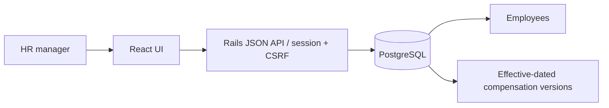

# Architecture and decisions

A Rails monolith serves a React build and JSON endpoints from one origin. PostgreSQL owns employee and compensation data. This avoids CORS, token storage in the browser, and operating two production services. Vite proxies `/api` during frontend development.

- Annual CTC is canonical. Monthly CTC and monthly components are derived with decimal arithmetic; rounding differences are explicitly returned. This prevents contradictory annual/monthly values. Monthly CTC is not payroll or take-home pay.
- Each version contains its own currency, components, effective date, actor, and reason. JSONB components keep country-specific naming flexible while the model validates precision and exact totals. PostgreSQL numeric stores totals. Supported currencies are an explicit seven-currency allowlist; extend it deliberately with precision rules.
- Effective salary is the latest version on or before the requested date. A unique employee/date constraint prevents ambiguity. Salary writes lock the employee row and check its version, then increment it. Employee edits also use optimistic locking.
- No salary update/delete endpoints exist. Model callbacks prohibit modification. Database administrators can still change data: this is application audit history, not a tamper-proof ledger. Mistakes are corrected with a new dated version; same-date corrections need a future explicit workflow.
- Pagination is performed in SQL (25 rows). Current compensation is fetched in one batched query. Reports aggregate in PostgreSQL, including median. The employee/effective-date index supports selection; search uses escaped ILIKE suitable for 10,000 rows. Trigram indexing is deferred until measurements justify it.
- Reports use the current active workforce and effective-dated salaries. They do not reconstruct historic employment status or organization structure. Original currency amounts are never summed together.
- Session cookies are HttpOnly, Rails CSRF protection remains enabled, production enforces HTTPS, and salary endpoints return no-store. Login attempts are limited with an in-process cache; run one application process for this local assessment. A shared limiter and enterprise SSO are production follow-ups.
- Runtime is Ruby 3.4.7, matching the available development toolchain. PostgreSQL replaces the generated SQLite setup. React uses Vite and plain CSS with Lucide icons; small native controls keep dependencies and accessibility behavior manageable.

## Verification strategy
Domain tests exercise money reconciliation, rounding, effective dates, immutability, and stale writes. Request tests exercise authorization, employee creation, salary recording, and reporting. Build checks cover React bundling. Seed reruns must preserve employee edits and salary history.

## Validation-driven refinements

Browser testing against all seven currencies revealed that Ruby's rounding at zero decimal places returns an Integer, unlike two-decimal BigDecimal rounding. Explicit decimal serialization and a JPY regression test address this. CSV import tests cover full rollback after a later invalid row. CSRF is exercised with forgery protection explicitly enabled in a request test.

The static security scanner reported the starter Rails 7.2 line as unsupported. The app was upgraded to Rails 8.1.4, including framework defaults, and the test suite and autoload checks rerun. See the [official release](https://rubyonrails.org/2026/9/24/Rails-Version-8-1-4-has-been-released).

Reference conversion is intentionally a labeled planning example using synthetic fixed INR rates dated 2026-01-01. It is not historical valuation, and never alters recorded compensation. Rate management and real market-rate sourcing are deferred.
